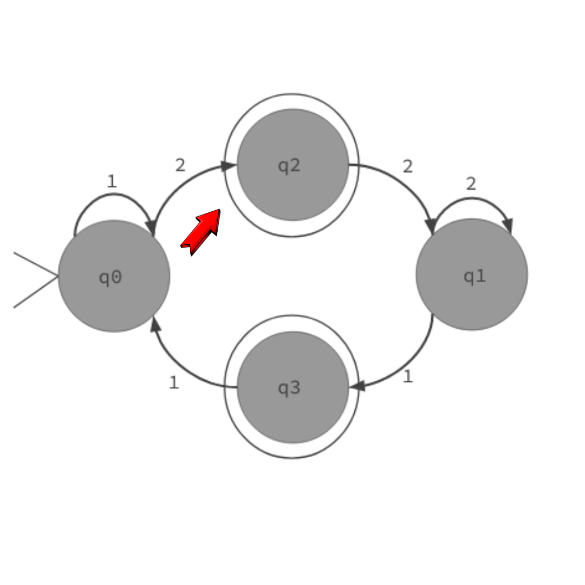

# Automata Finite Deterministic Traffic Light | Teory of Computation
A deterministic finite automaton project for the Computer Theory discipline at the Federal University of Alagoas. Semester 2023.2

  

Group:

  
    Matheus Ryan | Lucas Heron | Vinícius Neitzke
 

 ## What is a deterministic finite automaton?
 A deterministic finite automaton (DFA), also known as a deterministic finite-state machine, is a simple computational model used in computer science and linguistics. It helps recognize patterns in strings of symbols, like letters in a word.

 ## Why is a traffic light a good example of DFA?

* Finite states: A semaphore has a finite number of states, typically two: available (semaphore value greater than 0) and unavailable (semaphore value 0). This aligns with the finite states requirement of a DFA.

* Deterministic transitions: The behavior of a semaphore is deterministic based on its current state and the operation performed (acquire or release). This determinism matches the core principle of a DFA, where each state has a predefined transition for each input symbol.

## Our semaphore:

  

